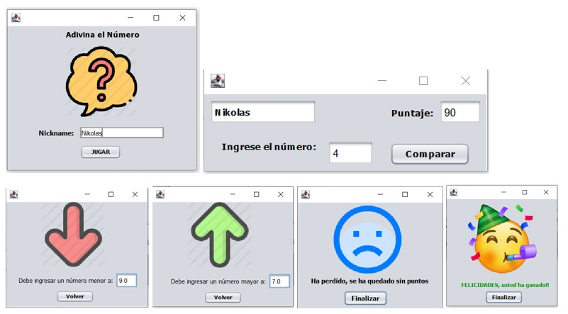

# RandomNumerGame
Juego de adivinar un número aleatorio. - Game to guess a random number. 

Juego con una GUI donde se tiene que adivinar un número entre el 1.0 al 10.0 y a traves de interfaces auxiliares se van presentando pistas de si se debe ingresar un número mayor o un número menor, si se acierta se gana, y solo se tienen 10 oportunidades.

Game with a GUI where you have to guess a number between 1.0 and 10.0 and through auxiliary interfaces are presented clues as to whether to enter a higher or lower number, if you guess right you win, and you only have 10 chances.

